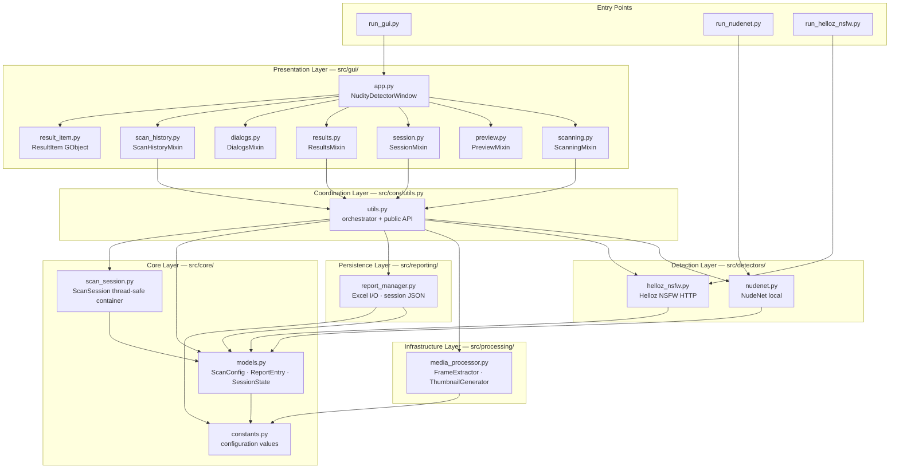

# 01 — System Architecture

Full component overview showing all source layers and their dependency direction.
Dependencies flow strictly downward — upper layers never import from layers above them.

