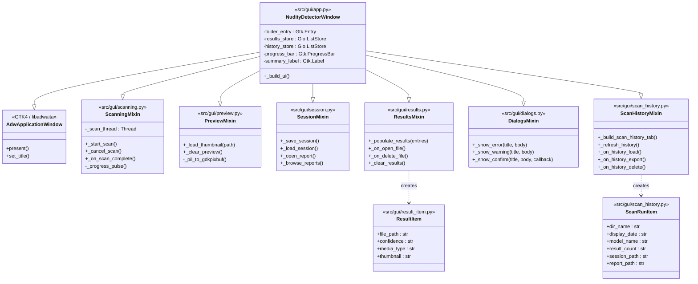

# 02 — GUI Mixin Composition

`NudityDetectorWindow` inherits from six focused mixins and `Adw.ApplicationWindow`.
Each mixin owns a single slice of the window's behaviour.
Mixins do not import each other — they communicate only through shared widget
attributes created by `_build_ui` in `app.py`.

