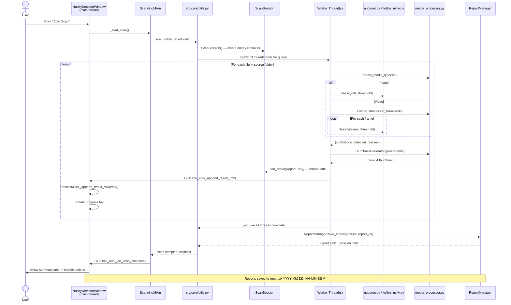
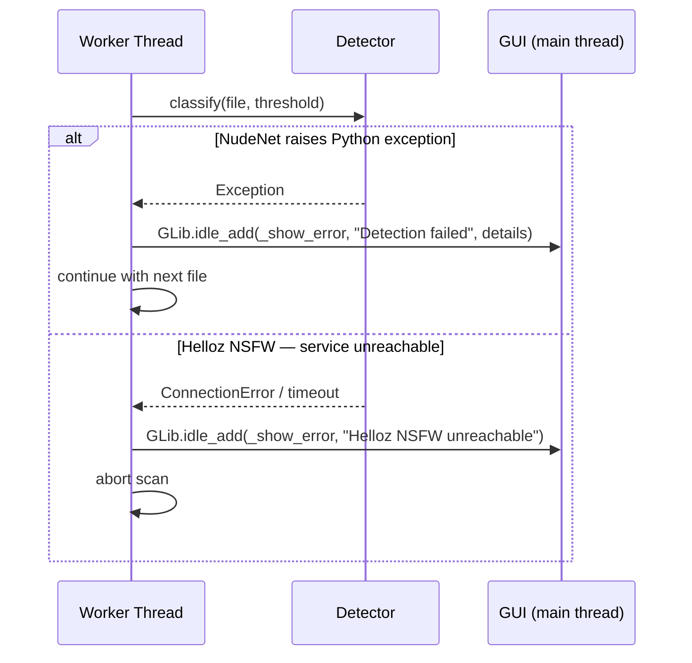

# 03 — Scan Data Flow

End-to-end sequence for a scan initiated from the GUI.
Worker threads process files concurrently; all GUI updates are marshalled back
to the main thread via `GLib.idle_add` (see ADD-006).

## Error paths

