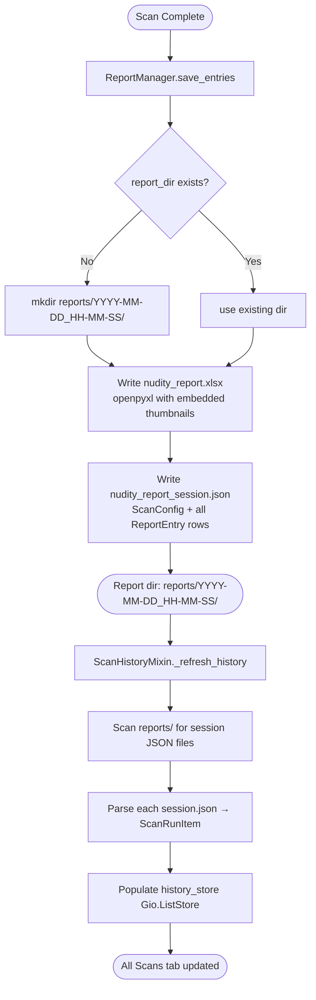
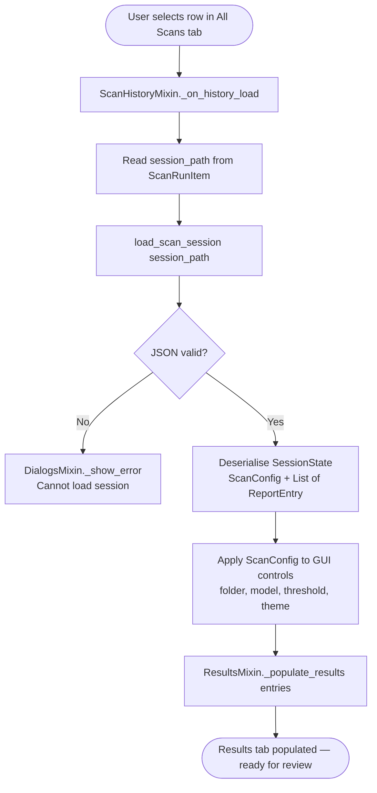
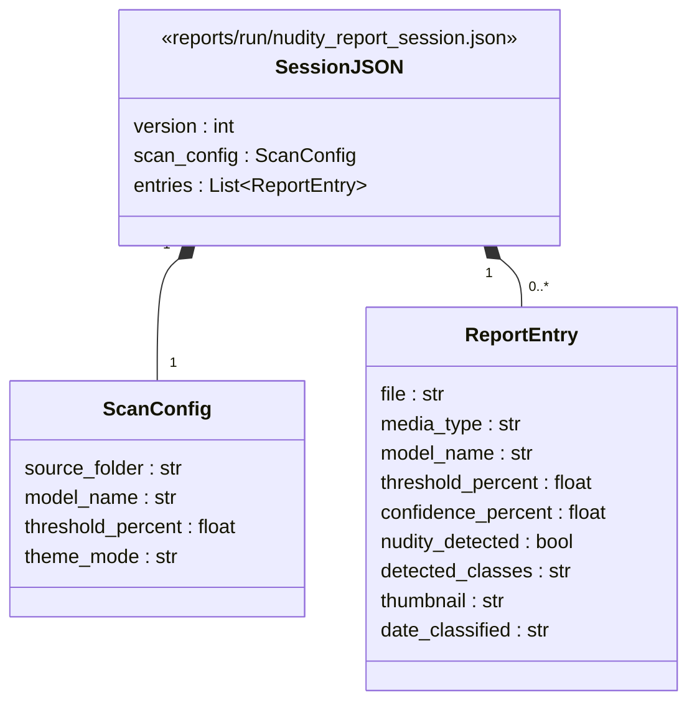

# 04 — Session Persistence

Shows how scan results are saved to disk and how the scan history tab
re-indexes the reports directory on startup.

## Session Save

## Session Load

## Session file format

