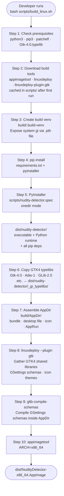

# 05 — Build Pipeline

The full packaging pipeline from source to distributable AppImage,
covering both local developer builds and the CI release workflow.

## Local build (scripts/build_linux.sh)



## CI release workflow (.github/workflows/release.yml)

```mermaid
flowchart TD
    A([Git tag pushed\nv1.2.3]) --> B[GitHub Actions runner\nubuntu-latest]
    B --> C[actions/checkout@v4]
    C --> D[actions/setup-python@v5\npython 3.12]
    D --> E[apt-get install\nGTK4 system packages\nlibgtk-4-dev · libadwaita-1-dev\ngir1.2-gtk-4.0 · fuse · libfuse2\npkg-config · patchelf]
    E --> F[pip install\nrequirements.txt + pyinstaller]
    F --> G[bash scripts/build_linux.sh\nAPPIMAGE_EXTRACT_AND_RUN=1]
    G --> H{Build succeeded?}
    H -- No --> I([Workflow fails\nno release created])
    H -- Yes --> J[Verify artifacts\ndist/NudityDetector-x86_64.AppImage\ndist/nudity-detector/]
    J --> K[Rename to\nNudityDetector-v1.2.3-x86_64.AppImage]
    K --> L[softprops/action-gh-release@v2\nCreate GitHub Release\nUpload AppImage as asset]
    L --> M([GitHub Release published\nnudity-detector v1.2.3])

    style I fill:#7f1d1d,color:#fca5a5
    style M fill:#14532d,color:#86efac
```

## What is bundled vs host-required

| Component | Bundled in AppImage | Notes |
|-----------|--------------------|----|
| Python 3.12 runtime | Yes | PyInstaller embeds interpreter |
| pip dependencies | Yes | Collected by PyInstaller |
| GTK4 shared libraries | Best-effort | `linuxdeploy-plugin-gtk` collects from build host |
| GTK4 GI typelibs | Yes | Explicitly copied by `build_linux.sh` step 6 |
| GSettings schemas + themes | Yes | Collected by `linuxdeploy-plugin-gtk` |
| NudeNet model weights | No | Downloaded on first run — requires internet access |
| libadwaita | Best-effort | Must be installed on build host |
